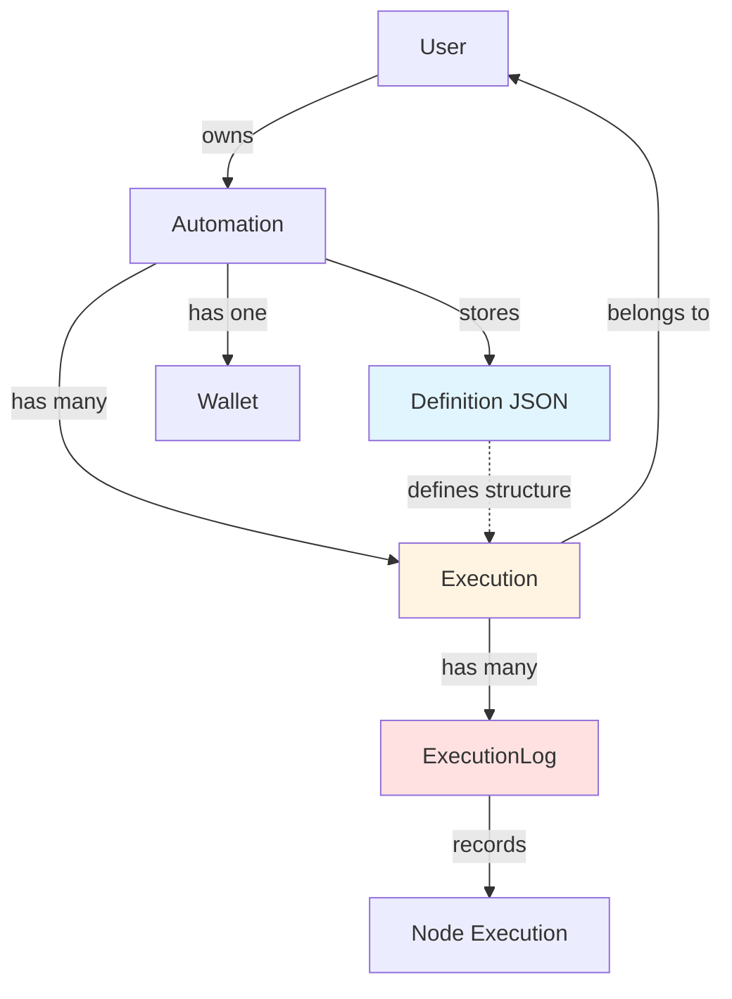
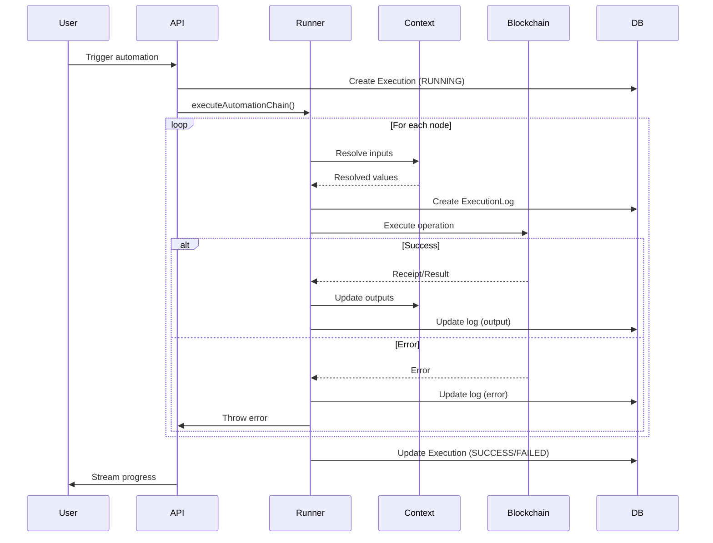
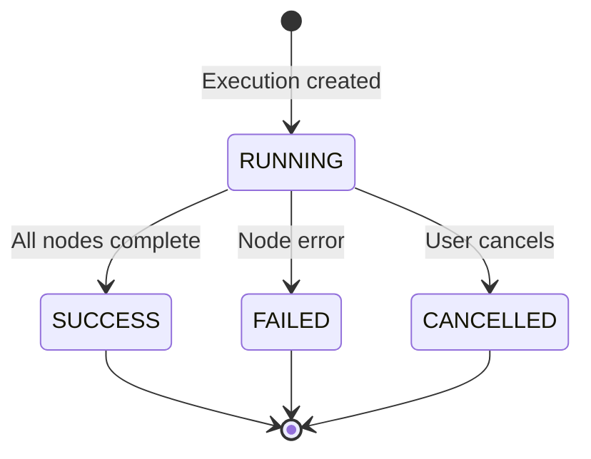

# Definition Debugging Guide

**Purpose**: This document explains how automation definitions work in PulseFlow and provides systematic debugging strategies for diagnosing failures based on execution data. This guide is designed for AI debugging bots and developers troubleshooting automation issues.

---

## Table of Contents

1. [Architecture Overview](#architecture-overview)
2. [Definition Anatomy](#definition-anatomy)
3. [Execution Lifecycle](#execution-lifecycle)
4. [Data Resolution & Context](#data-resolution--context)
5. [Error Types & Patterns](#error-types--patterns)
6. [Debugging Strategies](#debugging-strategies)
7. [Execution Log Analysis](#execution-log-analysis)
8. [Database Queries](#database-queries)
9. [Code References](#code-references)
10. [Debugging Checklist](#debugging-checklist)
11. [Example Scenarios](#example-scenarios)

---

## Architecture Overview

PulseFlow is a visual automation platform for blockchain operations on PulseChain. Users create workflows as node graphs that execute deterministically using isolated wallets.

### Data Model Relationships



### Execution Flow



### Key Concepts

- **Automation**: Container for a workflow, includes settings and wallet
- **Definition**: JSON structure with nodes and edges (React Flow format)
- **Execution**: Single run instance with status tracking
- **ExecutionLog**: Per-node execution record with inputs/outputs/errors
- **ExecutionContext**: Runtime state tracking variables, outputs, forEach state

---

## Definition Anatomy

Definitions are React Flow graphs stored as JSON in the `Automation.definition` field.

### Structure

```typescript
{
  nodes: Node[],  // Workflow steps
  edges: Edge[]   // Connections between steps
}
```

### Node Structure

```json
{
  "id": "swap-1234567890",
  "type": "swap",
  "position": { "x": 250, "y": 100 },
  "data": {
    "config": {
      "amountIn": { "type": "static", "value": "1.0" },
      "path": ["0xA107...", "0xefD7..."],
      "dex": "pulsex"
    },
    "notes": "Swap 1 PLS for DAI"
  }
}
```

**Node Fields**:

- `id`: Unique identifier (format: `{type}-{timestamp}`)
- `type`: Node type (see catalog below)
- `position`: Visual coordinates in editor
- `data.config`: Node-specific configuration
- `data.notes`: Optional user notes

### Edge Structure

```json
{
  "id": "edge-1234567890",
  "source": "swap-1234567890",
  "target": "transfer-9876543210",
  "sourceHandle": "output",
  "targetHandle": "input",
  "type": "buttonedge"
}
```

**Edge Fields**:

- `id`: Unique identifier
- `source`: Source node ID
- `target`: Target node ID
- `sourceHandle`: Output handle (for conditional branches: `output-true`, `output-false`)
- `targetHandle`: Input handle (usually `"input"`)

### Node Types Catalog

#### Transaction Nodes

- **`start`**: Entry point (required, only one per automation)
- **`swap`**: Token swap (supports exact in/out modes)
- **`swapFromPLS`**: Swap PLS to token (legacy, use `swap` with `usePLS: true`)
- **`swapToPLS`**: Swap token to PLS
- **`addLiquidity`**: Add liquidity (token/token pairs)
- **`addLiquidityPLS`**: Add liquidity (token/PLS pairs)
- **`removeLiquidity`**: Remove liquidity (token/token pairs)
- **`removeLiquidityPLS`**: Remove liquidity (token/PLS pairs)
- **`transfer`**: Transfer tokens to address
- **`transferPLS`**: Transfer PLS to address
- **`burnToken`**: Burn tokens (send to 0x000...dead)
- **`claimToken`**: Claim tokens from playground contract

#### Query Nodes

- **`checkBalance`**: Read PLS balance
  - Output: `{ balance: bigint }`
- **`checkTokenBalance`**: Read token balance
  - Output: `{ balance: bigint }`
- **`checkLPTokenAmounts`**: Read LP position amounts
  - Output: `{ lpBalance: bigint, token0: string, token1: string, token0Amount: bigint, token1Amount: bigint }`
- **`dexQuote`**: Get swap quote without executing
  - Output: `{ amountOut: bigint }`

#### Control Flow Nodes (PRO)

- **`condition`**: Conditional branching
  - Outputs: `output-true` or `output-false` handles
  - Operators: `>`, `<`, `>=`, `<=`, `==`
- **`loop`**: Restart automation from beginning
- **`wait`**: Delay execution (seconds)
- **`gasGuard`**: Prevent execution if gas price exceeds threshold
- **`forEach`**: Iterate over addresses (must pair with `endForEach`)
- **`endForEach`**: End forEach loop

#### Utility Nodes

- **`variable`**: Store value in named variable
  - Sets variable in ExecutionContext
- **`calculator`**: Evaluate math expression with variables
  - Supports: `+`, `-`, `*`, `/`, `**`, `%`, `{{variableName}}`
- **`telegram`**: Send Telegram notification

#### Special Nodes

- **`getParent`**: Get parent token for playground tokens

### Edge Patterns

#### Linear Flow

```json
{"source": "start-1", "target": "swap-2"}
{"source": "swap-2", "target": "transfer-3"}
```

#### Conditional Branching

```json
{"source": "condition-1", "sourceHandle": "output-true", "target": "swap-2"}
{"source": "condition-1", "sourceHandle": "output-false", "target": "transfer-3"}
```

#### ForEach Loop

```json
{"source": "forEach-1", "target": "swap-2"}
{"source": "swap-2", "target": "endForEach-3"}
{"source": "endForEach-3", "target": "transfer-4"}
```

### Definition Validation Rules

**Critical Constraints**:

1. Must have exactly one `start` node
2. ForEach nodes must have paired `endForEach` nodes
3. No nested forEach loops
4. No `loop` nodes inside forEach blocks
5. All edges must reference valid node IDs
6. Condition nodes must have both `output-true` and `output-false` edges (or at least one)

---

## Execution Lifecycle

### Execution Creation

**Manual Execution** (`/api/automations/[id]/run`):

```typescript
const execution = await prisma.execution.create({
  data: {
    userId,
    automationId,
    status: "RUNNING",
    wasScheduled: false,
  },
});
```

**Scheduled Execution** (`/api/automations/[id]/run-cron`):

```typescript
const execution = await prisma.execution.create({
  data: {
    userId,
    automationId,
    status: "RUNNING",
    wasScheduled: true,
  },
});
```

### Execution Statuses



- **`RUNNING`**: Execution in progress
- **`SUCCESS`**: All nodes completed successfully
- **`FAILED`**: A node encountered an error
- **`CANCELLED`**: User cancelled via `/api/automations/[id]/stop`

### ExecutionLog Creation

For each node executed:

```typescript
// 1. Create log with input
const log = await prisma.executionLog.create({
  data: {
    executionId,
    nodeId: node.id,
    nodeType: node.type,
    input: serializeForPrisma(nodeData),
  },
});

// 2. Execute node
const result = await executeNode(node, context);

// 3. Update log with output or error
await prisma.executionLog.update({
  where: { id: log.id },
  data: {
    output: serializeForPrisma(result),
    // OR
    error: errorMessage,
  },
});
```

### Progress Events

The runner emits progress events during execution:

```typescript
type ProgressEventType =
  | "node_start"
  | "node_complete"
  | "node_error"
  | "branch_taken"
  | "cancelled";

interface ProgressEvent {
  type: ProgressEventType;
  nodeId: string;
  nodeType: string;
  data?: any;
  error?: string;
}
```

These events are streamed to the client via Server-Sent Events (SSE).

---

## Data Resolution & Context

### ExecutionContext

The context tracks runtime state across node executions:

```typescript
interface ExecutionContext {
  nodeOutputs: Map<string, Record<string, any>>; // nodeId -> output fields
  previousNodeId: string | null; // Last executed node
  previousNodeType: string | null; // Last executed node type
  variables: Map<string, bigint>; // Named variables
  forEachItem: {
    // Current forEach iteration
    address: string;
    index: number;
    total: number;
  } | null;
}
```

### AmountValue Types

Amount fields support multiple resolution strategies:

#### 1. Static Value

```json
{
  "type": "static",
  "value": "1.5"
}
```

Converts to: `parseEther("1.5")` = `1500000000000000000n`

#### 2. Previous Output

```json
{
  "type": "previousOutput",
  "field": "balance",
  "percentage": 50
}
```

Resolves to: `previousNodeOutput.balance * 0.5`

**Resolution**:

```typescript
const previousOutput = context.nodeOutputs.get(context.previousNodeId);
const fieldValue = previousOutput[field];
const amount = (fieldValue * BigInt(percentage * 100)) / 10000n;
```

**Errors**:

- `"No previous node output available"` - Used at start node or before any outputs
- `"Previous node output does not have field: {field}"` - Field doesn't exist

#### 3. Variable Reference

```json
{
  "type": "variable",
  "variableName": "userAmount"
}
```

Resolves to: `context.variables.get("userAmount")`

**Errors**:

- `"Variable '{name}' not found. Make sure a Variable node sets it before use."` - Variable not set

#### 4. LP Ratio

```json
{
  "type": "lpRatio",
  "baseTokenField": "token",
  "baseAmountField": "amountTokenDesired",
  "pairedToken": "0xA107..."
}
```

Calculates paired token amount based on LP reserves. Used for addLiquidity operations.

**Resolution Algorithm**:

1. Resolve base amount from `nodeData[baseAmountField]`
2. Get base token from `nodeData[baseTokenField]`
3. Query LP pair reserves from blockchain
4. Calculate: `pairedAmount = quote(baseAmount, reserveBase, reservePaired)`

**Errors**:

- `"LP ratio base amount field '{field}' not found in nodeData"`
- `"No LP exists between the specified tokens"`
- `"Failed to calculate amount from LP ratio: {details}"`

### Variable System

Variables are set by `variable` nodes and accessed by other nodes:

**Setting a Variable**:

```typescript
case "variable": {
  const variableName = nodeData.variableName;
  const amount = await resolveAmount(nodeData.amount, context, automationId);
  context = setVariable(context, variableName, amount);
  return { result: { value: amount }, context };
}
```

**Using a Variable**:

```json
{
  "amountIn": {
    "type": "variable",
    "variableName": "swapAmount"
  }
}
```

### ForEach Context

ForEach nodes iterate over a list of addresses:

```typescript
// Set forEach context for body nodes
context.forEachItem = {
  address: addresses[i],
  index: i,
  total: addresses.length,
};
```

**Sentinel Resolution**: Nodes inside forEach body can use `"__FOREACH_ITEM__"` which gets replaced:

```typescript
// Node config
{
  "recipient": "__FOREACH_ITEM__"
}

// Resolved at runtime
{
  "recipient": "0x1234..." // Current iteration address
}
```

**Errors**:

- `"Node uses 'For-Each Item' but is not inside a For-Each block"` - Sentinel used outside forEach

### Output Extraction

Query nodes return structured outputs:

```typescript
// checkBalance
{ balance: 150000000000000000000n }

// checkLPTokenAmounts
{
  lpBalance: 1000000000000000000n,
  token0: "0xA107...",
  token1: "0xefD7...",
  token0Amount: 50000000000000000000n,
  token1Amount: 25000000000000000000n
}

// dexQuote
{ amountOut: 1234567890123456789n }
```

Transaction nodes don't automatically extract structured outputs (returns receipt).

---

## Error Types & Patterns

Errors are parsed and classified by `parseBlockchainError()` in `src/lib/error-utils.ts`.

### Error Structure

```typescript
interface ParsedError {
  userMessage: string; // User-friendly message
  technicalDetails: string; // Full error for logs
  errorType: ErrorType; // 'network' | 'blockchain' | 'config' | 'unknown'
  isRetryable: boolean; // Can retry?
  code?: string; // Error code
  shortMessage?: string; // Short error description
  revertReason?: string; // Contract revert reason
  txHash?: string; // Transaction hash (if on-chain)
}
```

### Network Errors

**Characteristics**: Temporary, retryable, RPC-related

| Pattern                                         | User Message                                                    | Retryable |
| ----------------------------------------------- | --------------------------------------------------------------- | --------- |
| `504 Gateway`, `502 Bad Gateway`, `503 Service` | "RPC server is temporarily unavailable. Try again in a moment." | ✅        |
| `ETIMEDOUT`, `ECONNREFUSED`, `timeout`          | "Request timed out. The network may be congested."              | ✅        |
| `rate limit`, `429`, `too many requests`        | "Too many requests. Please wait and try again."                 | ✅        |
| `network error`, `fetch failed`                 | "Network connection failed. Check your internet connection."    | ✅        |

### Blockchain Errors

**Characteristics**: On-chain issues, usually not retryable

| Pattern                                           | User Message                                            | Retryable |
| ------------------------------------------------- | ------------------------------------------------------- | --------- |
| `insufficient funds`                              | "Wallet has insufficient funds for this transaction."   | ❌        |
| `gas required exceeds`, `exceeds block gas limit` | "Transaction would fail - gas estimation exceeded."     | ❌        |
| `nonce too low`, `nonce has already been used`    | "Transaction conflict - nonce already used. Try again." | ✅        |
| `execution reverted`, `revert`, `CALL_EXCEPTION`  | "Transaction would revert - check your parameters."     | ❌        |
| `user rejected`, `user denied`                    | "Transaction was rejected."                             | ❌        |
| `replacement.*underpriced`                        | "Gas price too low for replacement transaction."        | ✅        |

### Configuration Errors

**Characteristics**: Invalid parameters, setup issues

| Pattern                            | User Message                                          | Retryable |
| ---------------------------------- | ----------------------------------------------------- | --------- |
| `not found`, `does not exist`      | "Resource not found. Check your configuration."       | ❌        |
| `invalid address`, `invalid token` | "Invalid address provided. Check your configuration." | ❌        |

### Definition Errors

**Characteristics**: Invalid automation structure

```typescript
// Missing start node
throw new Error("No start node found in automation");

// ForEach validation
throw new Error("forEach node has no paired endForEach node");
throw new Error("Nested For-Each blocks are not supported");
throw new Error("Repeat node cannot be inside a For-Each body");
```

### Context Errors

**Characteristics**: Runtime data issues

```typescript
// Variable errors
throw new Error(
  `Variable '${name}' not found. Make sure a Variable node sets it before use.`,
);

// Previous output errors
throw new Error("No previous node output available");
throw new Error(`Previous node output does not have field: ${field}`);

// ForEach errors
throw new Error('Node uses "For-Each Item" but is not inside a For-Each block');
```

### Cancellation

```typescript
throw new Error("Execution cancelled by user");
```

### Error Logging

Errors are logged with different detail levels:

```typescript
// ExecutionLog.error: Technical details
error: "Error: CALL_EXCEPTION | execution reverted: INSUFFICIENT_OUTPUT_AMOUNT | ..."

// ExecutionLog.output: Parsed error info
output: {
  userMessage: "Transaction would revert - check your parameters.",
  errorType: "blockchain",
  isRetryable: false,
  revertReason: "INSUFFICIENT_OUTPUT_AMOUNT",
  txHash: "0xabc123..."
}

// Execution.error: User-friendly message
error: "swap (swap-1234567890) failed: Transaction would revert - check your parameters. (tx: 0xabc123...)"
```

---

## Debugging Strategies

### Strategy 1: Analyze Failed Execution

**When to use**: Execution status is `FAILED`

**Steps**:

1. **Load execution with logs**

   ```typescript
   const execution = await prisma.execution.findUnique({
     where: { id: executionId },
     include: {
       logs: { orderBy: { createdAt: "asc" } },
       automation: {
         include: { wallet: true },
       },
     },
   });
   ```

2. **Identify failure point**

   ```typescript
   const failedLog = execution.logs.find((log) => log.error !== null);
   if (!failedLog) {
     // Execution failed but no log error - check Execution.error
     console.log("Failure:", execution.error);
   }
   ```

3. **Examine failed node**

   ```typescript
   const definition = execution.automation.definition;
   const failedNode = definition.nodes.find((n) => n.id === failedLog.nodeId);
   ```

4. **Check error type**

   ```typescript
   if (failedLog.output?.errorType) {
     const { errorType, isRetryable, userMessage } = failedLog.output;
     console.log(
       `${errorType} error (retryable: ${isRetryable}): ${userMessage}`,
     );
   }
   ```

5. **Trace dependencies**

   ```typescript
   // What was this node trying to use?
   const input = failedLog.input;

   // Check for variable references
   if (input.amountIn?.type === "variable") {
     // Was this variable set?
     const variableNodes = definition.nodes.filter(
       (n) => n.type === "variable",
     );
     const setsBefore = variableNodes.some((vn) => {
       // Check if variable node executed before failed node
       return execution.logs.some(
         (log) => log.nodeId === vn.id && log.createdAt < failedLog.createdAt,
       );
     });
   }

   // Check for previous output references
   if (input.amountIn?.type === "previousOutput") {
     const prevLogs = execution.logs.filter(
       (log) => log.createdAt < failedLog.createdAt && log.output !== null,
     );
     const hasPreviousOutput = prevLogs.length > 0;
   }
   ```

6. **Generate diagnosis**

### Strategy 2: Trace Data Flow

**When to use**: Understanding how data moves through automation

**Steps**:

1. **Build execution graph**

   ```typescript
   const { nodes, edges } = definition;
   const nodeMap = new Map(nodes.map((n) => [n.id, n]));
   const edgesBySource = new Map();
   edges.forEach((e) => {
     if (!edgesBySource.has(e.source)) {
       edgesBySource.set(e.source, []);
     }
     edgesBySource.get(e.source).push(e);
   });
   ```

2. **Trace from start**

   ```typescript
   const startNode = nodes.find((n) => n.type === "start");
   const executionPath = [];
   let currentId = startNode.id;

   while (currentId) {
     executionPath.push(currentId);
     const outgoingEdges = edgesBySource.get(currentId) || [];
     // For simplicity, take first edge (real impl handles branches)
     currentId = outgoingEdges[0]?.target;
   }
   ```

3. **Simulate context changes**

   ```typescript
   const simulatedContext = {
     nodeOutputs: new Map(),
     variables: new Map(),
     previousNodeId: null,
   };

   for (const nodeId of executionPath) {
     const node = nodeMap.get(nodeId);
     const log = execution.logs.find((l) => l.nodeId === nodeId);

     if (log?.output) {
       simulatedContext.nodeOutputs.set(nodeId, log.output);
       simulatedContext.previousNodeId = nodeId;
     }

     if (node.type === "variable" && log?.output) {
       const varName = node.data.config.variableName;
       simulatedContext.variables.set(varName, log.output.value);
     }
   }
   ```

4. **Verify variable availability**
   ```typescript
   function checkVariableUsage(nodeConfig, nodeId, availableVars) {
     // Recursively check all fields for variable references
     for (const [key, value] of Object.entries(nodeConfig)) {
       if (value?.type === "variable") {
         if (!availableVars.has(value.variableName)) {
           return {
             error: `Variable '${value.variableName}' used but not defined`,
             nodeId,
             field: key,
           };
         }
       }
     }
     return null;
   }
   ```

### Strategy 3: Validate Definition Structure

**When to use**: Execution fails immediately or has structural issues

**Validations**:

```typescript
function validateDefinition(definition) {
  const { nodes, edges } = definition;
  const errors = [];

  // 1. Check for start node
  const startNodes = nodes.filter((n) => n.type === "start");
  if (startNodes.length === 0) {
    errors.push("No start node found");
  } else if (startNodes.length > 1) {
    errors.push("Multiple start nodes found");
  }

  // 2. Check forEach pairing
  const forEachNodes = nodes.filter((n) => n.type === "forEach");
  const endForEachNodes = nodes.filter((n) => n.type === "endForEach");
  if (forEachNodes.length !== endForEachNodes.length) {
    errors.push("Mismatched forEach/endForEach count");
  }

  // 3. Check edge validity
  const nodeIds = new Set(nodes.map((n) => n.id));
  edges.forEach((edge) => {
    if (!nodeIds.has(edge.source)) {
      errors.push(`Edge references non-existent source: ${edge.source}`);
    }
    if (!nodeIds.has(edge.target)) {
      errors.push(`Edge references non-existent target: ${edge.target}`);
    }
  });

  // 4. Check condition branches
  const conditionNodes = nodes.filter((n) => n.type === "condition");
  conditionNodes.forEach((condNode) => {
    const outgoingEdges = edges.filter((e) => e.source === condNode.id);
    const hasTrueBranch = outgoingEdges.some(
      (e) => e.sourceHandle === "output-true",
    );
    const hasFalseBranch = outgoingEdges.some(
      (e) => e.sourceHandle === "output-false",
    );

    if (!hasTrueBranch && !hasFalseBranch) {
      errors.push(`Condition node ${condNode.id} has no branches`);
    }
  });

  // 5. Check for orphaned nodes (no path from start)
  const reachableFromStart = new Set();
  const queue = [startNodes[0]?.id];
  while (queue.length > 0) {
    const currentId = queue.shift();
    if (!currentId || reachableFromStart.has(currentId)) continue;
    reachableFromStart.add(currentId);

    const outgoing = edges.filter((e) => e.source === currentId);
    outgoing.forEach((e) => queue.push(e.target));
  }

  nodes.forEach((node) => {
    if (node.type !== "start" && !reachableFromStart.has(node.id)) {
      errors.push(`Node ${node.id} (${node.type}) is not reachable from start`);
    }
  });

  return errors;
}
```

### Strategy 4: Common Issue Patterns

Quick diagnosis based on error messages:

| Error Message Pattern                                          | Likely Cause                                           | Fix                                                                   |
| -------------------------------------------------------------- | ------------------------------------------------------ | --------------------------------------------------------------------- |
| `Variable 'X' not found`                                       | Variable node not executed before usage                | Ensure variable node is in execution path before use                  |
| `No previous node output available`                            | Using previousOutput at start or after non-output node | Only use previousOutput after query nodes or after nodes with outputs |
| `Previous node output does not have field: X`                  | Field name mismatch                                    | Check available fields from previous node output                      |
| `forEach node has no paired endForEach`                        | Missing endForEach node                                | Add endForEach node after forEach body                                |
| `Node uses 'For-Each Item' but is not inside a For-Each block` | **FOREACH_ITEM** used outside forEach                  | Move node inside forEach block or use different value                 |
| `Nested For-Each blocks are not supported`                     | forEach inside forEach                                 | Remove nested forEach                                                 |
| `insufficient funds`                                           | Wallet balance too low                                 | Check wallet balance, reduce amount, or fund wallet                   |
| `execution reverted: INSUFFICIENT_OUTPUT_AMOUNT`               | Slippage too low or price moved                        | Increase slippage or check market conditions                          |
| `LP ratio calculation requires both tokens`                    | Missing token addresses                                | Ensure both token fields are populated                                |

---

## Execution Log Analysis

ExecutionLogs provide the most detailed view of what happened during execution.

### ExecutionLog Schema

```prisma
model ExecutionLog {
  id          String @id @default(cuid())
  executionId String

  nodeId   String  // React Flow node id
  nodeType String  // Node type (swap, condition, etc.)
  input    Json?   // Node configuration at execution time
  output   Json?   // Result data or error details
  error    String? // Technical error message

  createdAt DateTime @default(now())

  execution Execution @relation(fields: [executionId], references: [id], onDelete: Cascade)
}
```

### Reading Logs

**Sequential order**: Order by `createdAt` to see execution sequence

```typescript
const logs = await prisma.executionLog.findMany({
  where: { executionId },
  orderBy: { createdAt: "asc" },
});
```

**By node type**: Group logs to see all swaps, conditions, etc.

```typescript
const swapLogs = logs.filter((log) => log.nodeType === "swap");
```

### Input Field

Contains the node configuration **at execution time** (after resolution):

```json
{
  "nodeId": "swap-1234567890",
  "amountIn": "1500000000000000000",
  "path": ["0xA107...", "0xefD7..."],
  "slippage": 0.01,
  "deadline": 1234567890
}
```

**Use cases**:

- Verify what values were actually used
- Check if variables resolved correctly
- See forEach item substitution results

### Output Field

Contains results for successful nodes or parsed error details:

**Success (query node)**:

```json
{
  "balance": "150000000000000000000"
}
```

**Success (transaction node)**:

```json
{
  "amountOut": "1234567890123456789",
  "tokenOut": "0xefD7..."
}
```

**Error**:

```json
{
  "userMessage": "Transaction would revert - check your parameters.",
  "errorType": "blockchain",
  "isRetryable": false,
  "revertReason": "INSUFFICIENT_OUTPUT_AMOUNT",
  "txHash": "0xabc123..."
}
```

### Error Field

Contains technical error details (raw error message):

```
Error: execution reverted: INSUFFICIENT_OUTPUT_AMOUNT | CALL_EXCEPTION | shortMessage: execution reverted | code: CALL_EXCEPTION
```

### Reconstructing Execution Flow

```typescript
function reconstructFlow(logs) {
  const flow = [];

  for (const log of logs) {
    flow.push({
      timestamp: log.createdAt,
      nodeId: log.nodeId,
      nodeType: log.nodeType,
      status: log.error ? "failed" : "success",
      summary: generateSummary(log),
    });
  }

  return flow;
}

function generateSummary(log) {
  const { nodeType, input, output, error } = log;

  if (error) {
    return `${nodeType} failed: ${output?.userMessage || error}`;
  }

  switch (nodeType) {
    case "swap":
      return `Swapped ${formatEther(input.amountIn)} tokens`;
    case "checkBalance":
      return `Balance: ${formatEther(output.balance)} PLS`;
    case "condition":
      return `Condition evaluated: ${output.result ? "true" : "false"}`;
    case "variable":
      return `Set variable '${input.variableName}' = ${formatEther(output.value)}`;
    default:
      return `${nodeType} executed`;
  }
}
```

---

## Database Queries

Essential queries for debugging:

### Get Execution with Full Details

```typescript
const execution = await prisma.execution.findUnique({
  where: { id: executionId },
  include: {
    logs: {
      orderBy: { createdAt: "asc" },
    },
    automation: {
      include: {
        wallet: true,
      },
    },
    user: {
      select: {
        id: true,
        clerkId: true,
        plan: true,
      },
    },
  },
});
```

### Get Recent Executions for Automation

```typescript
const recentExecutions = await prisma.execution.findMany({
  where: {
    automationId: automationId,
  },
  include: {
    logs: {
      select: {
        nodeType: true,
        error: true,
      },
    },
  },
  orderBy: {
    startedAt: "desc",
  },
  take: 10,
});
```

### Get All Failed Executions

```typescript
const failedExecutions = await prisma.execution.findMany({
  where: {
    status: "FAILED",
    userId: userId,
  },
  include: {
    automation: {
      select: {
        id: true,
        name: true,
      },
    },
    logs: {
      where: {
        error: { not: null },
      },
    },
  },
  orderBy: {
    startedAt: "desc",
  },
});
```

### Get Logs for Specific Node Type

```typescript
const swapLogs = await prisma.executionLog.findMany({
  where: {
    executionId: executionId,
    nodeType: "swap",
  },
  orderBy: {
    createdAt: "asc",
  },
});
```

### Find Executions with Specific Error

```typescript
const executionsWithError = await prisma.execution.findMany({
  where: {
    error: {
      contains: "insufficient funds",
    },
  },
  include: {
    automation: true,
    logs: true,
  },
});
```

---

## Code References

Key files for understanding execution and debugging:

### Core Execution

- **`src/lib/automation-runner.ts`**: Main execution engine
  - `executeAutomationChain()`: Primary execution function
  - Node iteration and branching logic
  - Error handling and log creation
  - Progress event emission

### Context Management

- **`src/lib/execution-context.ts`**: ExecutionContext management
  - `createExecutionContext()`: Initialize context
  - `resolveAmount()`: Amount value resolution
  - `resolveAmountWithNodeData()`: LP ratio resolution
  - `setVariable()` / `getVariable()`: Variable management
  - `resolveForEachAddresses()`: ForEach sentinel replacement
  - `evaluateExpression()`: Calculator expression evaluation

### Node Execution

- **`src/lib/blockchain-functions.ts`**: Node executors
  - `executeNode()`: Main node execution dispatcher
  - Individual node handlers (swap, transfer, etc.)
  - Blockchain interaction functions
  - Output extraction helpers

### Error Handling

- **`src/lib/error-utils.ts`**: Error parsing and classification
  - `parseBlockchainError()`: Parse and classify errors
  - `ERROR_PATTERNS`: Error pattern matching rules
  - `ParsedError` type definition

### Database Schema

- **`prisma/schema.prisma`**: Database models
  - `Automation` model: Definition storage
  - `Execution` model: Execution tracking
  - `ExecutionLog` model: Per-node logs
  - `ExecutionStatus` enum

### API Endpoints

- **`src/app/api/automations/[id]/run/route.ts`**: Manual execution trigger
- **`src/app/api/automations/[id]/run-cron/route.ts`**: Scheduled execution
- **`src/app/api/automations/[id]/stop/route.ts`**: Cancel execution
- **`src/app/api/executions/route.ts`**: List executions
- **`src/app/api/executions/[id]/route.ts`**: Get execution details

---

## Debugging Checklist

Use this systematic checklist when debugging an execution:

### 1. Load Data

- [ ] Load execution with `include: { logs, automation, user }`
- [ ] Verify execution exists and belongs to correct user
- [ ] Check execution status (`RUNNING`, `SUCCESS`, `FAILED`, `CANCELLED`)
- [ ] Load automation definition (nodes and edges)

### 2. Identify Failure Point

- [ ] Find ExecutionLog with `error !== null`
- [ ] Note failed node ID and type
- [ ] Check `Execution.error` for user-facing error message
- [ ] Determine error type (`network`, `blockchain`, `config`, `unknown`)

### 3. Validate Definition Structure

- [ ] Verify start node exists
- [ ] Check forEach/endForEach pairing
- [ ] Validate edge references (all source/target nodes exist)
- [ ] Check condition nodes have appropriate branches
- [ ] Verify no nested forEach blocks

### 4. Analyze Failed Node Configuration

- [ ] Review `ExecutionLog.input` for actual configuration used
- [ ] Check all required fields are present
- [ ] Validate amount configurations (type, fields, values)
- [ ] Verify token addresses are valid
- [ ] Check slippage settings

### 5. Trace Data Dependencies

- [ ] If using `previousOutput`: Check previous node has output
- [ ] If using `variable`: Check variable node executed before usage
- [ ] If inside forEach: Check forEach node properly wraps failed node
- [ ] If using lpRatio: Validate token addresses and base amount field

### 6. Check Context State

- [ ] Reconstruct ExecutionContext from logs
- [ ] Verify all variables set before usage
- [ ] Check nodeOutputs map for previous nodes
- [ ] Validate forEach iteration state (if applicable)

### 7. Examine Error Details

- [ ] Read `ExecutionLog.error` for technical details
- [ ] Read `ExecutionLog.output` for parsed error info
- [ ] Check `isRetryable` flag
- [ ] Look for transaction hash (if on-chain error)
- [ ] Review revert reason (if contract revert)

### 8. Check External Factors

- [ ] Verify wallet has sufficient balance
- [ ] Check token approvals (if applicable)
- [ ] Review blockchain state (gas prices, network congestion)
- [ ] Validate LP exists for swap/liquidity operations
- [ ] Check if token addresses are correct

### 9. Generate Diagnosis

- [ ] Classify error category
- [ ] Identify root cause
- [ ] Determine if user can fix (config) or system issue
- [ ] Check if retry would help
- [ ] Provide specific fix recommendations

### 10. Document Findings

- [ ] Summarize what went wrong
- [ ] Explain why it happened
- [ ] Provide actionable fix steps
- [ ] Note any definition changes needed
- [ ] Suggest preventive measures

---

## Example Scenarios

### Scenario 1: Variable Not Found

**Error**:

```
Variable 'swapAmount' not found. Make sure a Variable node sets it before use.
```

**Analysis**:

1. Load execution and find failed log
2. Failed node type: `swap`
3. Failed node input: `{ amountIn: { type: 'variable', variableName: 'swapAmount' } }`
4. Search logs for variable nodes:
   ```typescript
   const variableLogs = execution.logs.filter(
     (log) => log.nodeType === "variable",
   );
   ```
5. Check if any variable node set `swapAmount`
6. Check execution order: Was variable node before swap node?

**Diagnosis**:

- If no variable node found: "Missing variable node that sets 'swapAmount'"
- If variable node exists but after swap: "Variable node executes after usage - check edge connections"
- If variable node in different branch: "Variable set in conditional branch, not available in this path"

**Fix**:

- Add variable node before swap node
- Ensure edge connects variable → swap
- Verify variable node is in same execution path (not in different condition branch)

### Scenario 2: Previous Output Field Missing

**Error**:

```
Previous node output does not have field: amountOut
```

**Analysis**:

1. Failed node uses: `{ amountIn: { type: 'previousOutput', field: 'amountOut' } }`
2. Find previous node from logs (order by createdAt)
3. Check previous node output:
   ```typescript
   const prevLog = logs[logs.indexOf(failedLog) - 1];
   console.log("Previous output:", prevLog.output);
   ```
4. Compare expected field with actual output fields

**Diagnosis**:
"Previous node (checkBalance) returns { balance }, not { amountOut }. Field mismatch."

**Fix**:

- Change field reference to `balance`
- Or use different previous node that has `amountOut`

### Scenario 3: ForEach Outside Loop

**Error**:

```
Node uses "For-Each Item" but is not inside a For-Each block
```

**Analysis**:

1. Failed node config contains: `"recipient": "__FOREACH_ITEM__"`
2. Check definition for forEach/endForEach nodes
3. Verify failed node is between forEach and endForEach in execution path
4. Build graph to check containment:
   ```typescript
   function isNodeInForEachBody(nodeId, definition) {
     // Find forEach → endForEach pairs
     // Check if nodeId is reachable from forEach and reaches endForEach
   }
   ```

**Diagnosis**:
"Node is outside forEach body - needs to be placed between forEach and endForEach nodes"

**Fix**:

- Move node into forEach body
- Ensure edges: forEach → [body nodes] → endForEach
- Or remove **FOREACH_ITEM** sentinel and use static address

### Scenario 4: Insufficient Balance

**Error**:

```
swap (swap-1234567890) failed: Wallet has insufficient funds for this transaction.
```

**Analysis**:

1. Error type: `blockchain`, not retryable
2. Check wallet address from automation
3. Query current balance:
   ```typescript
   const provider = getProvider();
   const balance = await provider.getBalance(automation.walletAddress);
   ```
4. Check swap input amount: `input.amountIn`
5. Compare balance vs required amount

**Diagnosis**:
"Wallet balance (0.5 PLS) is less than swap amount (1.0 PLS) + gas"

**Fix**:

- Fund wallet with more PLS
- Reduce swap amount
- Change amount to use percentage of balance

### Scenario 5: Insufficient Output Amount (Slippage)

**Error**:

```
swap (swap-1234567890) failed: Transaction would revert - check your parameters. (tx: 0xabc123...)
Error: execution reverted: INSUFFICIENT_OUTPUT_AMOUNT
```

**Analysis**:

1. Error type: `blockchain`, revert reason: `INSUFFICIENT_OUTPUT_AMOUNT`
2. This is a slippage error - price moved between quote and execution
3. Check swap config: `input.slippage` (default 0.01 = 1%)
4. Check if LP has sufficient liquidity
5. Review transaction on block explorer using txHash

**Diagnosis**:
"Price moved more than 1% slippage tolerance between estimation and execution. Large swap in low liquidity pool."

**Fix**:

- Increase slippage tolerance (e.g., 2-3%)
- Reduce swap amount to lower price impact
- Check if LP has enough liquidity
- Add delay/retry logic

### Scenario 6: LP Ratio Misconfiguration

**Error**:

```
No LP exists between the specified tokens
```

**Analysis**:

1. Node type: `addLiquidity` or `addLiquidityPLS`
2. Input shows lpRatio amount config:
   ```json
   {
     "type": "lpRatio",
     "baseTokenField": "token",
     "baseAmountField": "amountTokenDesired",
     "pairedToken": "0xabc..."
   }
   ```
3. Check if baseToken and pairedToken have LP
4. Query factory for pair address

**Diagnosis**:
"No LP exists for token pair. Cannot calculate ratio without existing liquidity."

**Fix**:

- Verify token addresses are correct
- Check if LP actually exists on-chain
- For new LPs, can't use lpRatio - must specify both amounts statically
- Use dexQuote node first to check LP existence

### Scenario 7: Nested ForEach

**Error**:

```
Nested For-Each blocks are not supported
```

**Analysis**:

1. Execution failed immediately (no logs created)
2. Validate definition structure
3. Find forEach nodes and check their bodies:
   ```typescript
   const forEachNodes = nodes.filter((n) => n.type === "forEach");
   for (const fe of forEachNodes) {
     const bodyNodes = getForEachBodyNodes(fe.id, definition);
     const hasNestedForEach = bodyNodes.some((n) => n.type === "forEach");
     if (hasNestedForEach) {
       // Found nested forEach
     }
   }
   ```

**Diagnosis**:
"ForEach node at swap-1234567890 contains another forEach node in its body. Nesting is not allowed."

**Fix**:

- Remove nested forEach
- Restructure flow to avoid nesting
- Use separate automations if needed

### Scenario 8: Condition Without Branches

**Error**:
Execution stops or takes unexpected path

**Analysis**:

1. Find condition node in execution logs
2. Check condition output: `{ result: true }` or `{ result: false }`
3. Find edges from condition node:
   ```typescript
   const conditionEdges = edges.filter((e) => e.source === conditionNodeId);
   const trueBranch = conditionEdges.find(
     (e) => e.sourceHandle === "output-true",
   );
   const falseBranch = conditionEdges.find(
     (e) => e.sourceHandle === "output-false",
   );
   ```
4. Check if taken branch exists

**Diagnosis**:
"Condition evaluated to false but no output-false edge exists. Execution stopped."

**Fix**:

- Add edge for false branch
- Or change condition logic to always take true path
- Add default handling for both branches

---

## Advanced Debugging Techniques

### Simulating Execution

Test definition without blockchain interaction:

```typescript
async function simulateExecution(definition, mockData) {
  const context = createExecutionContext();
  const { nodes, edges } = definition;

  // Mock blockchain calls
  const mockExecuteNode = (node, ctx) => {
    if (mockData[node.id]) {
      return { result: mockData[node.id], context: ctx };
    }
    // Return dummy data based on node type
    switch (node.type) {
      case "checkBalance":
        return { result: { balance: parseEther("10") }, context: ctx };
      case "swap":
        return { result: { amountOut: parseEther("5") }, context: ctx };
      default:
        return { result: null, context: ctx };
    }
  };

  // Run simulation
  const startNode = nodes.find((n) => n.type === "start");
  const logs = [];

  // ... traverse graph and mock execute each node

  return { logs, finalContext: context };
}
```

### Comparing Executions

Find what changed between working and broken executions:

```typescript
function compareExecutions(execution1, execution2) {
  const diff = {
    definition: [],
    inputs: [],
    outputs: [],
    timing: [],
  };

  // Compare definitions
  const def1Nodes = execution1.automation.definition.nodes;
  const def2Nodes = execution2.automation.definition.nodes;

  // Find changed nodes
  def1Nodes.forEach((n1) => {
    const n2 = def2Nodes.find((n) => n.id === n1.id);
    if (!n2) {
      diff.definition.push(`Node ${n1.id} removed`);
    } else if (JSON.stringify(n1.data) !== JSON.stringify(n2.data)) {
      diff.definition.push(`Node ${n1.id} config changed`);
    }
  });

  // Compare logs
  execution1.logs.forEach((log1, idx) => {
    const log2 = execution2.logs[idx];
    if (!log2 || log1.nodeType !== log2.nodeType) {
      diff.inputs.push(`Execution path diverged at step ${idx}`);
      return;
    }

    if (JSON.stringify(log1.input) !== JSON.stringify(log2.input)) {
      diff.inputs.push(`Node ${log1.nodeId} inputs changed`);
    }

    if (JSON.stringify(log1.output) !== JSON.stringify(log2.output)) {
      diff.outputs.push(`Node ${log1.nodeId} outputs changed`);
    }
  });

  return diff;
}
```

### Pattern Detection

Find common failure patterns across executions:

```typescript
async function detectPatterns(userId) {
  const failedExecutions = await prisma.execution.findMany({
    where: { userId, status: "FAILED" },
    include: { logs: true, automation: true },
  });

  const patterns = {
    nodeTypeFailures: {},
    errorTypes: {},
    commonErrors: {},
  };

  failedExecutions.forEach((execution) => {
    const failedLog = execution.logs.find((log) => log.error);
    if (!failedLog) return;

    // Count failures by node type
    patterns.nodeTypeFailures[failedLog.nodeType] =
      (patterns.nodeTypeFailures[failedLog.nodeType] || 0) + 1;

    // Count by error type
    if (failedLog.output?.errorType) {
      patterns.errorTypes[failedLog.output.errorType] =
        (patterns.errorTypes[failedLog.output.errorType] || 0) + 1;
    }

    // Common error messages
    const errMsg = failedLog.output?.userMessage || failedLog.error;
    if (errMsg) {
      patterns.commonErrors[errMsg] = (patterns.commonErrors[errMsg] || 0) + 1;
    }
  });

  return patterns;
}
```

---

## Summary

This guide provides comprehensive debugging strategies for PulseFlow automation definitions:

**Key Takeaways**:

1. Definitions are React Flow graphs (nodes + edges) stored in `Automation.definition`
2. Executions create ExecutionLogs for each node with input/output/error
3. ExecutionContext tracks variables, outputs, and forEach state
4. Errors are classified (network/blockchain/config) with retryable flag
5. Use systematic debugging: load data → identify failure → trace dependencies → diagnose

**Primary Debugging Flow**:

```
Load Execution + Logs → Find Failed Node → Check Error Type →
Validate Definition → Trace Data Dependencies → Check Context State →
Generate Diagnosis → Provide Fix
```

**Essential Tools**:

- Database queries to load execution data
- Definition validation for structural issues
- Context simulation for data flow tracing
- Error pattern matching for quick diagnosis
- Log analysis for detailed execution history

For implementation details, refer to the code references section and examine the actual source files.

---

**Last Updated**: 2026-02-14  
**Version**: 1.0
